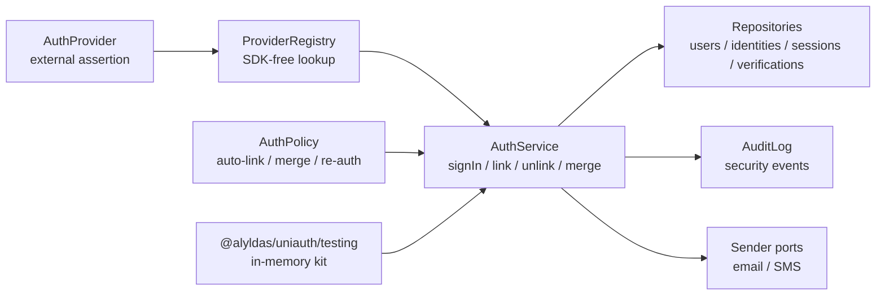
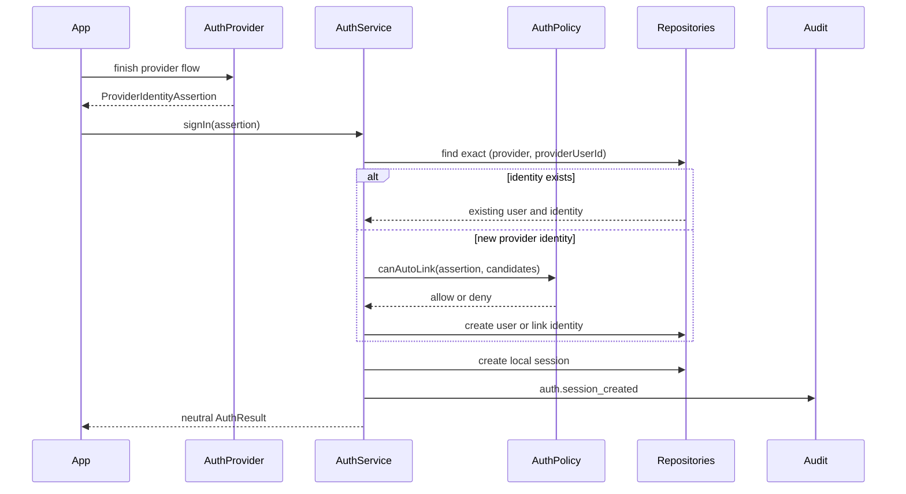
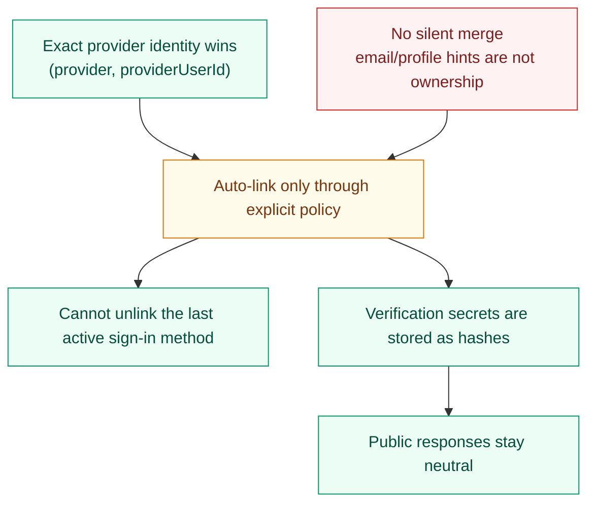

# Uniauth

[](https://github.com/alyldas/uniauth/actions/workflows/ci.yml)
[](package.json)
[](LICENSE)
[](https://www.typescriptlang.org/)
[](https://github.com/alyldas/uniauth/pkgs/npm/uniauth)

`@alyldas/uniauth` is a headless identity orchestration core for TypeScript and Node.js.

It models users, identities, credentials, verifications, sessions, account linking policy,
and storage/provider ports without owning UI, HTTP routes, cookies, an ORM, or a hosted auth service.

The package is source-available under the PolyForm Strict License 1.0.0. Commercial use,
redistribution, making changes, or creating new works based on the software require a separate paid
license, subscription, private contract, or other written permission.

## What This Package Does

- Models `User`, `AuthIdentity`, `Credential`, `Verification`, and `Session` separately.
- Treats email and phone as optional identity attributes, not mandatory user fields.
- Orchestrates `signIn`, `link`, `unlink`, `mergeAccounts`, verification, and session revocation.
- Starts and finishes generic OTP challenges over email or phone through sender ports.
- Creates local session records after successful sign-in.
- Uses explicit policy for auto-linking, unlinking, re-auth, and account merge decisions.
- Exposes ports for repositories, providers, sender infrastructure, audit logs, and transactions.
- Ships an in-memory testing implementation through `@alyldas/uniauth/testing`.

## What It Does Not Do

- It is not a hosted auth service.
- It does not ship frontend pages or UI components.
- It does not include Express, Fastify, Nest, Nuxt, or Next handlers in core.
- It does not generate one mandatory ORM schema.
- It does not include SMTP, SMS gateway, OAuth, Telegram, or MAX SDK implementations in core.
- It does not send messages by itself; OTP delivery uses sender ports you provide.
- It does not silently merge two existing users by email.

## Diagrams







## Install

Install from GitHub Packages:

```sh
npm install @alyldas/uniauth
```

Configure the GitHub Packages registry for the package scope:

```text
@alyldas:registry=https://npm.pkg.github.com
```

GitHub Packages can require authentication for package reads. Use a token with `read:packages` in
local npm config or CI secrets; do not commit tokens.

## Runtime Contract

Core imports come from the root entry point:

```ts
import {
  DefaultAuthService,
  EMAIL_OTP_PROVIDER_ID,
  OtpChannel,
  PHONE_OTP_PROVIDER_ID,
  VerificationPurpose,
  createDefaultAuthPolicy,
  type AuthProvider,
  type AuthService,
  type ProviderIdentityAssertion,
} from '@alyldas/uniauth'
```

Testing helpers come from the explicit testing entry point:

```ts
import {
  InMemoryEmailSender,
  InMemorySmsSender,
  StaticAuthProvider,
  createInMemoryAuthKit,
} from '@alyldas/uniauth/testing'
```

There are no root side effects. Importing the package does not register providers, touch storage,
create sessions, read environment variables, or mutate global state.

The service contract is policy-driven:

```ts
const { service } = createInMemoryAuthKit({
  policy: createDefaultAuthPolicy({
    allowAutoLink: false,
    allowMergeAccounts: false,
  }),
})

const result = await service.signIn({
  assertion: {
    provider: 'email-otp',
    providerUserId: 'alice@example.com',
    email: 'alice@example.com',
    emailVerified: true,
  },
})
```

OTP sign-in is still headless: `startOtpChallenge` creates a hashed verification secret and sends
the plain code through the configured sender port; `finishOtpSignIn` consumes the code once and
creates a local session. Email-specific methods remain as compatibility wrappers.

```ts
const { service } = createInMemoryAuthKit()

const challenge = await service.startOtpChallenge({
  purpose: VerificationPurpose.SignIn,
  channel: OtpChannel.Phone,
  target: '+15551234567',
  secret: '123456',
})

const result = await service.finishOtpSignIn({
  verificationId: challenge.verificationId,
  secret: '123456',
})

console.log(result.identity.provider === PHONE_OTP_PROVIDER_ID)
```

The email wrapper uses the same shared OTP challenge path:

```ts
const emailChallenge = await service.startEmailOtpSignIn({
  email: 'alice@example.com',
  secret: '123456',
})

const emailResult = await service.finishEmailOtpSignIn({
  verificationId: emailChallenge.verificationId,
  secret: '123456',
})

console.log(emailResult.identity.provider === EMAIL_OTP_PROVIDER_ID)
```

## Entry Points

- `@alyldas/uniauth`: public domain types, service implementation, policy API, ports, errors, and utilities.
- `@alyldas/uniauth/testing`: in-memory store, provider registry, static provider, in-memory email
  and SMS senders, and test kit.

## Attribution

The root entry point exposes attribution metadata and a pure helper for About, Legal, Notices, or
acknowledgements screens:

```ts
import { UNIAUTH_ATTRIBUTION, getUniauthAttributionNotice } from '@alyldas/uniauth'

const metadata = UNIAUTH_ATTRIBUTION
const notice = getUniauthAttributionNotice({ productName: 'Example App' })
```

The helper does not send telemetry, read environment variables, touch storage, or expose anything
automatically.

For commercial licensing, paid subscription terms, written agreements, or attribution questions,
contact `alyldas@ya.ru`.

## Examples

- [Basic Node example](examples/basic-node/index.ts)

## Documentation

- [Architecture](docs/architecture.md)
- [Security model](docs/security.md)
- [Comparison](docs/comparison.md)
- [Licensing and attribution](docs/licensing.md)
- [Roadmap](docs/roadmap.md)

## Generated Files

This repository keeps package source and documentation in git. Do not commit generated output:

- `dist`
- `coverage`
- `.typecheck`
- `node_modules`
- `*.tgz`

`dist` is created by `npm run build`, `npm run test:exports`, `npm run test:consumer`,
`npm run pack:dry`, and `npm run prepare`.

`npm run test:consumer` creates a temporary external npm project, installs the packed tarball, and
imports `@alyldas/uniauth` plus `@alyldas/uniauth/testing` by package name.

`npm run test:registry` creates a temporary external npm project and installs the published package
from GitHub Packages. It requires `NODE_AUTH_TOKEN`, `GITHUB_TOKEN`, or an authenticated `gh` CLI
session with `read:packages`.

To keep generated `dist` and `coverage` output inside a Node 22 Alpine container, run:

```sh
npm run check:docker
```

For the same package gate through Docker Compose, run:

```sh
npm run check:compose
```

## Release Checklist

Run the package gate before publishing:

```sh
npm run check
```

The gate runs formatting, ESLint, typecheck, 100% coverage, export smoke tests, consumer install
smoke tests, and `npm pack --dry-run`.

The release workflow follows the same Release Please model as `theme-mode`: pushes to `main` update
a release PR, and merging that PR creates the `v*` tag, GitHub release notes, and GitHub Packages
publish. This repository uses the `RELEASE_PLEASE_TOKEN` secret for release PR automation and
`GITHUB_TOKEN` for package publishing.

After a release is published, verify the registry package:

```sh
npm run test:registry
```

## Contributing

See [CONTRIBUTING.md](CONTRIBUTING.md).

## Security

See [SECURITY.md](SECURITY.md).
