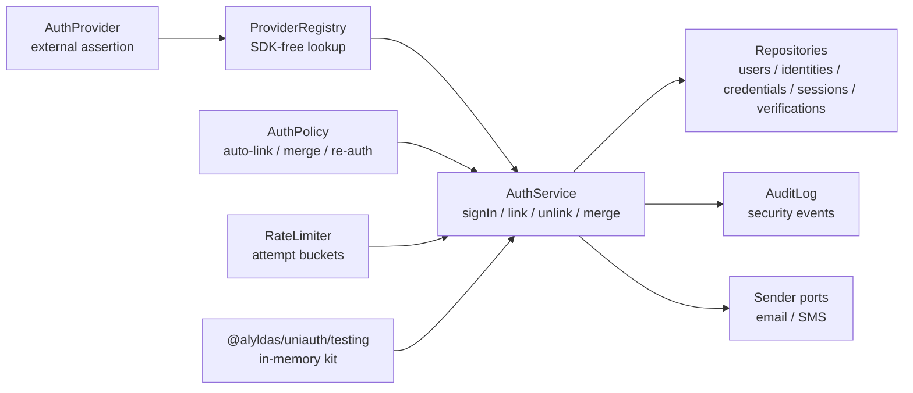
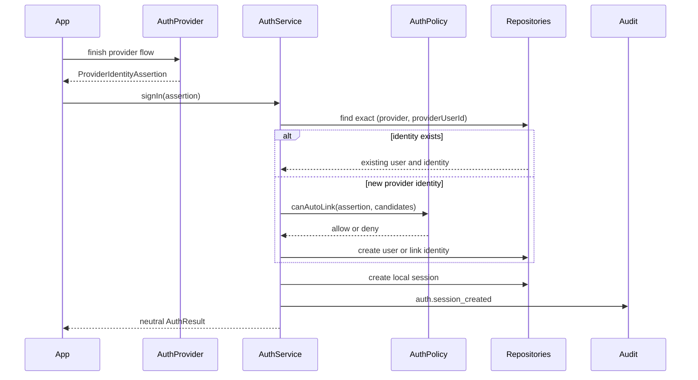
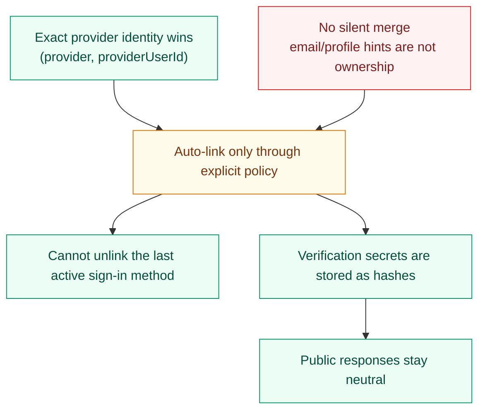

# UniAuth

[](https://github.com/alyldas/uniauth/actions/workflows/ci.yml)
[](package.json)
[](LICENSE)
[](https://www.typescriptlang.org/)
[](https://github.com/alyldas/uniauth/pkgs/npm/uniauth)

`@alyldas/uniauth` is an ESM-only headless identity orchestration core for TypeScript and Node.js.

It models users, identities, credentials, verifications, sessions, account linking policy, and
storage/provider ports without owning UI, HTTP routes, cookies, an ORM, or a hosted auth service.

The package is source-available under the PolyForm Strict License 1.0.0. Commercial use,
redistribution, making changes, or creating new works based on the software require a separate paid
license, subscription, private contract, or other written permission.

## What This Package Does

- Models `User`, `AuthIdentity`, `Credential`, `Verification`, and `Session` separately.
- Treats email and phone as optional identity attributes, not mandatory user fields.
- Orchestrates `signIn`, `link`, `unlink`, `mergeAccounts`, verification, and session revocation.
- Starts and finishes generic OTP challenges over email or phone through sender ports.
- Starts and finishes email magic-link sign-in on the shared verification lifecycle.
- Hashes password credentials through a password hasher port, stores them through a credential repo,
  and signs in with a local password identity.
- Starts and finishes email password recovery on the shared verification lifecycle.
- Validates signed Telegram Mini App and MAX WebApp `initData` without provider SDK lock-in.
- Maps SDK-free OAuth/OIDC provider profiles into the existing provider sign-in pipeline.
- Creates local session records after successful sign-in.
- Uses explicit policy for auto-linking, unlinking, re-auth, and account merge decisions.
- Runs transaction-aware account merge over identities, credentials, sessions, and audit decisions
  when the configured `UnitOfWork` supports atomic rollback.
- Exposes ports for repositories, providers, sender infrastructure, rate limits, password hashing,
  audit logs, and transactions.
- Ships an in-memory testing implementation through `@alyldas/uniauth/testing`.
- Ships a reference Postgres persistence adapter through `@alyldas/uniauth/postgres`.

## What It Does Not Do

- It is not a hosted auth service.
- It does not ship frontend pages or UI components.
- It does not include Express, Fastify, Nest, Nuxt, or Next handlers in core.
- It does not generate one mandatory ORM schema.
- It does not include SMTP, SMS gateway, OAuth/OIDC, Telegram, or MAX SDKs, bot setup, webhook
  handlers, or frontend bridge code in core.
- It does not send messages by itself; OTP, magic-link, and recovery delivery use sender ports you
  provide.
- It does not bundle a password hashing runtime; password hashing uses a `PasswordHasher` adapter you
  provide.
- It does not ship a production Redis, database, or edge rate limiter.
- It does not silently merge two existing users by email.

## Diagrams







## Install

Install from GitHub Packages:

```sh
npm install @alyldas/uniauth
```

Configure the GitHub Packages registry for the package scope:

```text
@alyldas:registry=https://npm.pkg.github.com
```

GitHub Packages can require authentication for package reads. Use a token with `read:packages` in
local npm config or CI secrets; do not commit tokens.

## Runtime Contract

The package targets modern ESM TypeScript consumers on Node.js 22 or newer.
The repository keeps `.node-version` as the local Node.js 22 runtime marker.

Core imports come from the root entry point:

```ts
import {
  DefaultAuthService,
  EMAIL_MAGIC_LINK_PROVIDER_ID,
  EMAIL_OTP_PROVIDER_ID,
  OtpChannel,
  PASSWORD_PROVIDER_ID,
  ProviderTrustLevel,
  RateLimitAction,
  UniAuthError,
  UniAuthErrorCode,
  VerificationPurpose,
  createDefaultAuthPolicy,
  createHmacSecretHasher,
  isUniAuthError,
  type AuthProvider,
  type AuthService,
  type EmailMagicLink,
  type EmailPasswordRecoveryLink,
  type PasswordHasher,
  type ProviderIdentityAssertion,
  type RateLimiter,
  type SecretHasher,
} from '@alyldas/uniauth'
```

Testing helpers come from the explicit testing entry point:

```ts
import {
  InMemoryEmailSender,
  InMemoryPasswordHasher,
  InMemoryRateLimiter,
  InMemorySmsSender,
  StaticAuthProvider,
  createInMemoryAuthKit,
} from '@alyldas/uniauth/testing'
```

Reference persistence helpers come from the Postgres entry point:

```ts
import {
  POSTGRES_AUTH_SCHEMA_SQL,
  applyPostgresAuthSchema,
  createPostgresAuthStore,
} from '@alyldas/uniauth/postgres'
```

There are no root side effects. Importing the package does not register providers, touch storage,
create sessions, read environment variables, or mutate global state.

The service contract is policy-driven:

```ts
const policy = {
  ...createDefaultAuthPolicy({
    allowAutoLink: true,
    allowMergeAccounts: false,
  }),
  canAutoLink(context) {
    return (
      context.assertion.trust?.level === ProviderTrustLevel.Trusted &&
      context.existingIdentities.every(
        (identity) => identity.trust?.level !== ProviderTrustLevel.Untrusted,
      )
    )
  },
}

const { service } = createInMemoryAuthKit({
  policy,
})

const result = await service.signIn({
  assertion: {
    provider: 'email-otp',
    providerUserId: 'alice@example.com',
    email: 'alice@example.com',
    emailVerified: true,
    trust: {
      level: ProviderTrustLevel.Trusted,
      signals: ['first-party-email'],
    },
  },
})
```

Messenger Mini App providers are SDK-free `AuthProvider` adapters for signed Telegram and MAX
launch data. See [Messenger providers](docs/messenger-providers.md).

OAuth/OIDC providers use an SDK-free client contract for authorization-code finish flows. See
[OAuth / OIDC providers](docs/oauth-oidc.md).

Reference Postgres persistence lives in a separate subpath so the core API stays ORM-free and does
not take a hard runtime dependency on `pg`. See [Postgres persistence](docs/postgres.md).

Public error helpers use the `UniAuth` brand casing:

```ts
try {
  await service.signIn({})
} catch (error) {
  if (isUniAuthError(error) && error.code === UniAuthErrorCode.InvalidInput) {
    throw new UniAuthError(UniAuthErrorCode.InvalidInput, error.message)
  }
}
```

Rate limiting is optional and app-owned. Core calls a `RateLimiter` port before security-sensitive
attempts and turns a denied decision into a stable `UniAuthErrorCode.RateLimited` error without
creating users, sessions, or consuming OTP verifications.

```ts
const rateLimiter: RateLimiter = {
  async consume(input) {
    if (input.action === RateLimitAction.OtpStart) {
      return { allowed: false, retryAfterSeconds: 60 }
    }

    return { allowed: true }
  },
}

const { service } = createInMemoryAuthKit({ rateLimiter })
```

OTP sign-in is still headless: `startOtpChallenge` creates a hashed verification secret and sends
the plain code through the configured sender port; `finishOtpSignIn` consumes the code once and
creates a local session. Email and phone OTP both use this unified API.

```ts
const { service } = createInMemoryAuthKit()

const challenge = await service.startOtpChallenge({
  purpose: VerificationPurpose.SignIn,
  channel: OtpChannel.Email,
  target: 'alice@example.com',
  secret: '123456',
})

const result = await service.finishOtpSignIn({
  verificationId: challenge.verificationId,
  secret: '123456',
  channel: OtpChannel.Email,
})

console.log(result.identity.provider === EMAIL_OTP_PROVIDER_ID)
```

Core-owned verification routing fields, such as `provider` and `channel`, are stored separately
from app-owned `metadata`.

OTP generation and the built-in email subject are configurable through service options. A
per-request `secret` still wins over the configured generator.

```ts
const { service } = createInMemoryAuthKit({
  emailOtpSubject: 'Your Example App code',
  otpSecretLength: 8,
  otpSecretGenerator: ({ target }) => `app-owned-code-for:${target}`,
})
```

Email magic links also use the same hashed verification lifecycle. Core does not own your route,
domain, redirect handling, or cookie transport; the application provides a `createLink` function and
an `EmailSender`.

```ts
const magicLink = await service.startEmailMagicLinkSignIn({
  email: 'alice@example.com',
  createLink(input: EmailMagicLink) {
    return `/auth/magic?verification=${input.verificationId}&token=${input.secret}`
  },
})

const magicResult = await service.finishEmailMagicLinkSignIn({
  verificationId: magicLink.verificationId,
  secret: 'token-from-request',
})

console.log(magicResult.identity.provider === EMAIL_MAGIC_LINK_PROVIDER_ID)
```

Password credentials use a dedicated `CredentialRepo` and a `PasswordHasher` port. Production apps
should provide an adapter backed by their chosen password hashing runtime and parameters; the
in-memory testing kit only ships a deterministic test hasher.

```ts
const passwordHasher: PasswordHasher = {
  async hash(password) {
    return hashPassword(password)
  },
  async verify(password, passwordHash) {
    return verifyPassword(passwordHash, password)
  },
}

const { service } = createInMemoryAuthKit({ passwordHasher })

await service.setPassword({
  userId,
  email: 'alice@example.com',
  password: 'new password from settings form',
})

const passwordResult = await service.signInWithPassword({
  email: 'alice@example.com',
  password: 'password from sign-in form',
})

console.log(passwordResult.identity.provider === PASSWORD_PROVIDER_ID)
```

Password recovery is an email verification flow. Core creates a hashed recovery secret and calls
your `createLink` function; your application owns the route and reset form.

```ts
const recovery = await service.startEmailPasswordRecovery({
  email: 'alice@example.com',
  createLink(input: EmailPasswordRecoveryLink) {
    return `/auth/recovery?verification=${input.verificationId}&token=${input.secret}`
  },
})

await service.finishEmailPasswordRecovery({
  verificationId: recovery.verificationId,
  secret: 'token-from-request',
  newPassword: 'new password from reset form',
})
```

OTP delivery is outside the storage transaction. `startOtpChallenge` first persists the hashed
verification record, then calls the configured sender port. If the sender rejects, the pending
verification remains in storage until it is consumed, expires, or is cleaned up by your adapter.
This keeps external SMTP/SMS/queue side effects out of `UnitOfWork`; applications that need retry or
dead-letter behavior should implement it in their sender adapter.

Verification hashing is pluggable. The default hasher keeps the package usable out of the box, while
production OTP deployments should provide an app-owned pepper through `createHmacSecretHasher` or a
custom `SecretHasher` implementation:

```ts
import { createHmacSecretHasher } from '@alyldas/uniauth'
import { createInMemoryAuthKit } from '@alyldas/uniauth/testing'

const secretPepper = process.env.UNIAUTH_SECRET_PEPPER

if (!secretPepper) {
  throw new Error('UNIAUTH_SECRET_PEPPER is required.')
}

const { service } = createInMemoryAuthKit({
  secretHasher: createHmacSecretHasher({
    pepper: secretPepper,
  }),
})
```

The package never reads environment variables by itself; application bootstrap code owns secret
loading and rotation policy.

## Adapter Author Guide

Storage adapters should preserve these invariants:

- Keep `User` and `AuthIdentity` as separate records.
- Enforce uniqueness for `(provider, providerUserId)`.
- Run link, unlink, merge, session, and verification writes inside the provided transaction boundary.
- Store verification secrets only through the configured `SecretHasher`.
- Do not infer ownership from email, phone, or provider profile metadata outside `AuthPolicy`.
- Keep sender side effects outside storage transactions.

Provider adapters should return a normalized `ProviderIdentityAssertion` from `finish()`. Raw
provider payloads should stay adapter-owned or be reduced to explicit `metadata`; core does not
persist raw provider profiles.

## Entry Points

- `@alyldas/uniauth`: public domain types, service implementation, policy API, ports, errors, and utilities.
- `@alyldas/uniauth/postgres`: reference Postgres repositories, schema helper, and transaction wiring.
- `@alyldas/uniauth/testing`: in-memory store, provider registry, static provider, in-memory email
  and SMS senders, and test kit.

## Attribution

The root entry point exposes attribution metadata and a pure helper for About, Legal, Notices, or
acknowledgements screens:

```ts
import { UNIAUTH_ATTRIBUTION, getUniAuthAttributionNotice } from '@alyldas/uniauth'

const metadata = UNIAUTH_ATTRIBUTION
const notice = getUniAuthAttributionNotice({ productName: 'Example App' })
```

The helper does not send telemetry, read environment variables, touch storage, or expose anything
automatically.

For commercial licensing, paid subscription terms, written agreements, or attribution questions,
contact `alyldas@ya.ru`.

## Examples

- [Basic Node example](examples/basic-node/index.ts)

## Documentation

- [Development](docs/development.md)
- [Architecture](docs/architecture.md)
- [Security model](docs/security.md)
- [Local auth flows](docs/local-auth.md)
- [Messenger providers](docs/messenger-providers.md)
- [OAuth / OIDC providers](docs/oauth-oidc.md)
- [Postgres persistence](docs/postgres.md)
- [Comparison](docs/comparison.md)
- [Licensing and attribution](docs/licensing.md)
- [Roadmap](docs/roadmap.md)

## Generated Files

This repository keeps package source and documentation in git. Do not commit generated output:

- `dist`
- `coverage`
- `node_modules`
- `*.tgz`

`dist` is created by `npm run build`, `npm run test:exports`, and npm pack based commands
(`npm run test:types-package`, `npm run pack:dry`, release publish) through `prepack`.
`npm run prepare` only installs local Husky hooks when the project is inside a git repository.

`npm run lint:package` runs `publint` against the built package metadata, entry points, exports,
type declarations, and published file set.

`npm run test:types-package` runs `attw --pack . --profile esm-only` to verify package type
resolution from the packed tarball across modern ESM TypeScript consumer resolution modes. CommonJS
`require` is intentionally outside the support target for this ESM-only package.

To keep generated `dist` and `coverage` output inside a Node 22 Alpine container, run:

```sh
npm run check:docker
```

For the same package gate through Docker Compose, run:

```sh
npm run check:compose
```

## Release Checklist

Run the package gate before publishing:

```sh
npm run check
```

The gate runs formatting, ESLint, typecheck, 100% coverage, export smoke tests, package lint,
package type-resolution checks, and `npm pack --dry-run`.

The release workflow follows the same Release Please model as `theme-mode`: pushes to `main` update
a release PR, and merging that PR creates the `v*` tag, GitHub release notes, and GitHub Packages
publish. This repository uses the `RELEASE_PLEASE_TOKEN` secret for release PR automation and
`GITHUB_TOKEN` for package publishing.

Normal feature, fix, refactor, docs, and test commits do not manually change release metadata.
Release Please owns these files in its release PR:

- `package.json`: package version.
- `package-lock.json`: lockfile package version.
- `CHANGELOG.md`: release section and compare links.

Only bypass that rule for an intentional manual release process.

Follow the changelog and merge policy in [CONTRIBUTING.md](CONTRIBUTING.md): regular feature and API
PRs should preserve useful Conventional Commits, while Release Please PRs can stay single release
commits.

After a release is published, verify the package page and GitHub Packages artifact manually against
the generated release notes and local `npm pack --dry-run` output.

## Contributing

See [CONTRIBUTING.md](CONTRIBUTING.md).

## Security

See [SECURITY.md](SECURITY.md).
